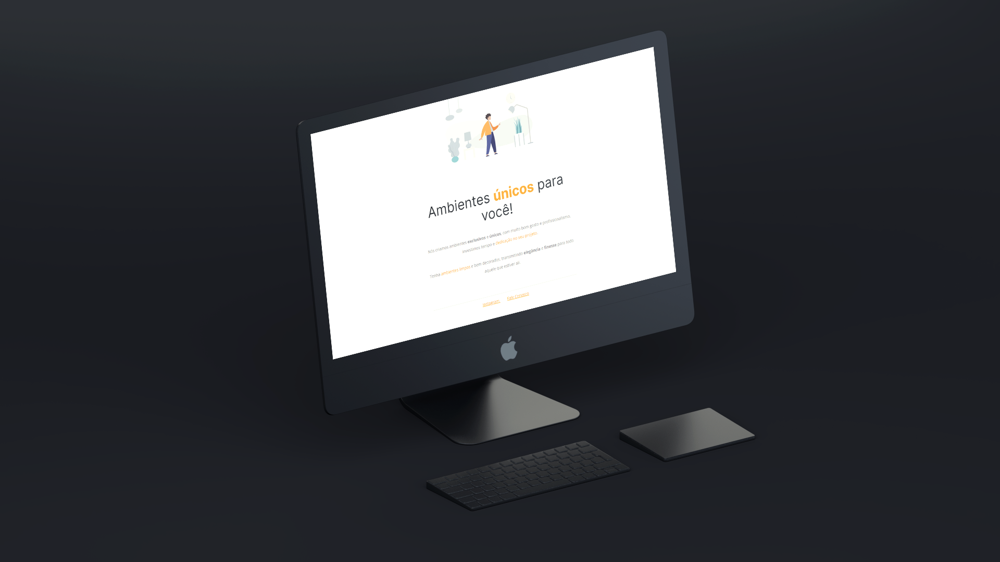

  

## 🖥️ Projeto
Esse é um projeto de ambientes customizados, que foi desenvolvido durante o Stage 02 do curso Explorer da Rockeatseat, com as seguintes tecnologias:

- HTML
- CSS
- Git e Github

## 🔖 Layout
Você pode visualizar o layout do projeto através
[desse link](https://www.figma.com/file/9AFCPQR2SzEWIMk219TR6Q/Explorer---Projeto-01-(Copy)).
É necessário ter uma conta no [Figma](https://www.figma.com).